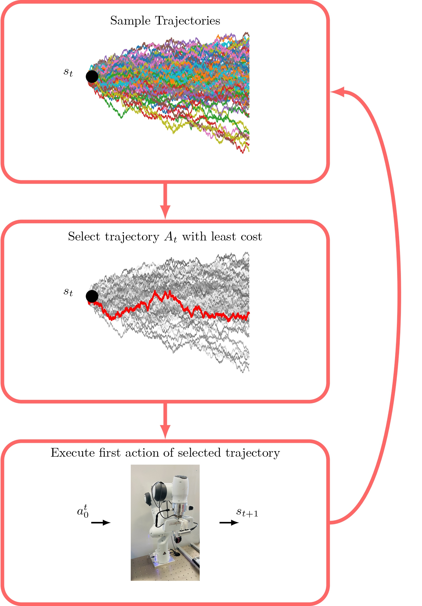
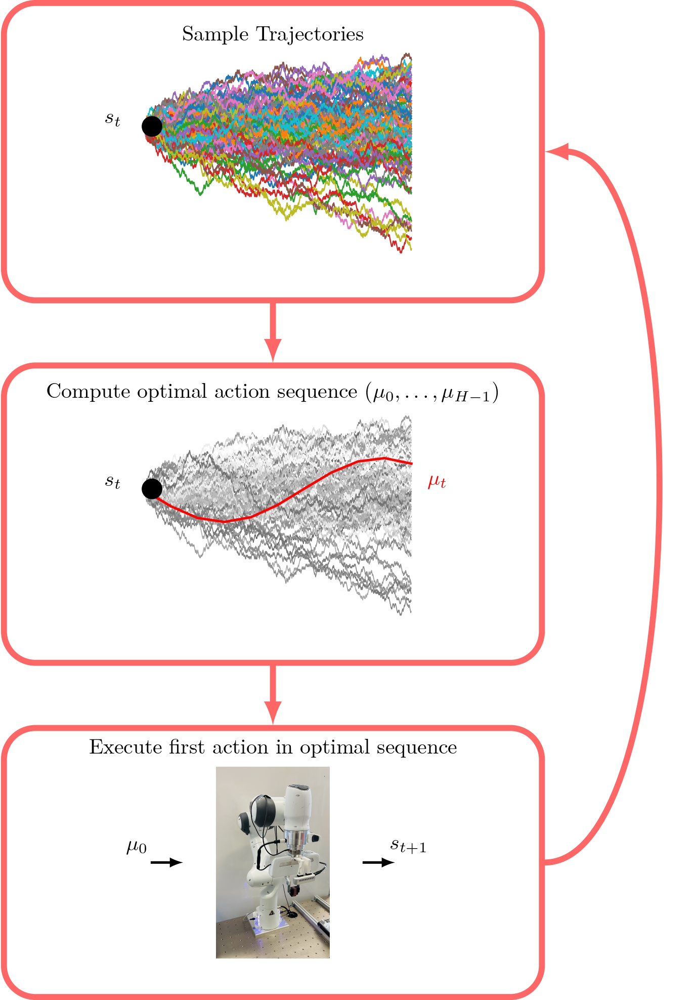

# Model Learning

## MLP based

### Training

State action pair ($s_t$, $a_t$) as input, predicts $\Delta\hat{s}_{t+1}$, $a_t$ as target.

- State: postion, orientation and force at robot end-effector
- Action: postion, orientation and force setpoints given to controller (Note: force setopints are always zero, here for ease of computations)

### Network

Multi-layer perceptrons, two hidden layers with 500 neurons per layer.

### Loss function

Supervised training minimizes the model's error $E(\theta)$ for a training dataset $\mathcal{D}\_\text{TRAIN}$ by using stochastic gradient descent with Adam optimizer for weight update as follows,
```math
E(\theta) = \frac{1}{|\mathcal{D}\_\text{TRAIN}|} \sum_{(s_t,a_t,s_{t+1})\in \mathcal{D}\_\text{TRAIN}}\frac{1}{2}\|s_{t+1}-\hat{s}\_{t+1}\|\_{\text{pos,force}}^2  + \mathcal{G}(s_{t+1}-\hat{s}\_{t+1})_{\text{rot}}
```
where, indices $\text{pos}$, $\text{rot}$ and $\text{force}$ denote position, rotation and force. $\mathcal{G}$ is the geodesic loss that computes rotational distance.  

### Model-based Control

Using the dynamics model and cost function, the discounted receding horizon cost-to-go $J$ for executing a sequence of $H$ actions in the environment is computed by the following equation,  
```math
J =  r(s_t,a_t)+ \gamma r(s_{t+1},a_{t+1})+ ... +\gamma^H r(s_{t+H},a_{t+H}) =  \sum_{k=0}^H \gamma^{k}r({s}\_{t+k},a_{t+k})
```
The optimal control sequence at each time step is computed by optimizing the following equation,  
```math
(a_t,a_{t+1},\ldots,a_{t+H-1}) = \underset{(a\in A)}{\arg\min} \ J
```

The feedback controller is formulated by solving the above optimization problem repeatedly at each timestep and applying only the first element of the optimal action sequence.
The first element of the optimal sequence, $a_t$ is executed on the system. Then, the system transitions to the next state $s_{t+1}$ and the optimal control sequence is recomputed again over the horizon $H$.

Two controllers available are Random Shooting and Model Predictive Path Integral(MPPI)
### Random Shooting
Random shooting is a sampling based optimization method that generates random sequences of
candidate samples for evaluation.  First, $N$ candidate action sequences each containing $H$ random actions are sampled to form a sequence $A_k = (a^k_0,\ldots,a^k_{H-1}) ,\forall k\in N$ from some distribution like Gaussian or uniform distribution. For these actions next states are estimated through the dynamics model and cost is computed. Trajectory with the least cost is selected and executed on the environment.
<<p align="center">>
    
</p>

### Model Predictive Path Integral
MPPI is based on importance sampling with a smoother update rule that aggregates the samples to compute the update. Instead of directly sampling candidate action sequences from a Gaussian, this method uses a filtering technique to compute smooth candidate control sequences.
<p align="center">
    
</p>
